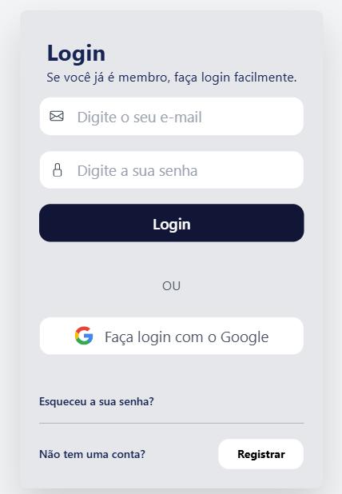

# Página de Login

Este projeto é uma aplicação web de autenticação que inclui páginas de login, registro e recuperação de senha. Foi desenvolvido utilizando **Tailwind CSS** para estilização e **JavaScript** para interatividade. O projeto foi desenvolvido com foco na responsividade, adaptando-se a diferentes tamanhos de tela.

## Funcionalidades ✨

* **Login:** Permite que usuários existentes façam login com e-mail e senha, ou através do Google.
* **Registro:** Permite que novos usuários criem uma conta.
* **Recuperação de Senha:** Permite que usuários recuperem suas senhas através de um link enviado por e-mail.

## Tecnologias Utilizadas ⌨️

* **HTML:** Estrutura da página.
* **Tailwind CSS:** Framework CSS para estilização responsiva.
* **JavaScript:** Interatividade e lógica do frontend.

## Desenvolvido por 🖤

Este projeto foi desenvolvido inteiramente por mim, utilizando pesquisas e documentação online para aprendizado e implementação das funcionalidades.

## Status do Projeto 🚧

Este projeto ainda está em desenvolvimento. Algumas funcionalidades estão em fase de teste e implementação, como:

* Validação de formulários com JavaScript.
* Melhorias de acessibilidade.
* Implementação completa da recuperação de senha no backend.
* Testes de segurança.

## Resultado final 

- **Para celulares** 📱: 

- **Para tablets e desktops** 🖥️:

